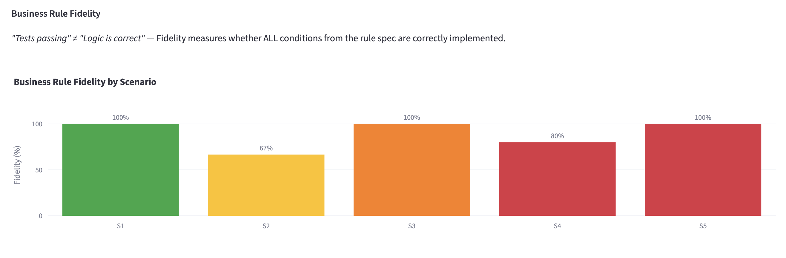
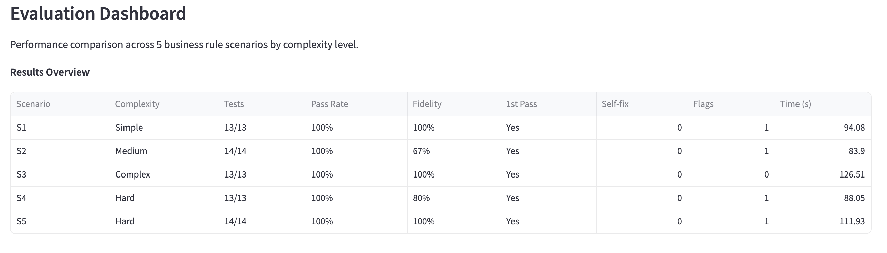

# Insurance Rule-to-Test Agentic Coding PoC

> **Independent Project** — LLM-based Agentic Coding PoC for insurance business rule automation
> Developer-in-the-loop: business rule → code/test/doc draft generation with self-correction and compliance verification

## Motivation

When insurance business rules change, developers manually modify code, write tests, and update documentation. This creates a bottleneck — especially for frequent regulatory updates. This PoC demonstrates how an **Agentic Coding pipeline** can automate the **draft generation** of code, tests, and documentation, while keeping **developers in the loop** for final review and approval.

**Key question:** *"How much of the rule-to-code process can be reliably automated, and where does human review remain essential?"*

**Input:** Natural language business rule (Korean)
**Output:** Python code draft + pytest tests + compliance report + fidelity verification + developer review document

## Architecture

```
[Input: Business Rule (Natural Language)]
         |
         v
+---------------------------+
| Node 1: Rule Interpreter  |  Sonnet
| NL --> Structured JSON    |
+---------------------------+
         |
         v
+---------------------------+
| Node 2: Code Generator    |  Sonnet
| JSON spec --> Python code |
+---------------------------+
         |
         v
+---------------------------+
| Node 3: Test Generator    |  Sonnet
| Normal + Boundary +       |
| Exception + Error tests   |
+---------------------------+
         |
         v
+---------------------------+     +-- failure (max 3) ---+
| Node 4: Test Runner       |     |                      |
| Sandboxed pytest execution| ----+                      |
+---------------------------+                            |
         |                                               |
         | pass                     +--------------------+
         v                          v
+---------------------------+     +---------------------------+
| Node 5: Compliance Check  |     | Node 2: Code Generator    |
| - PII logging detection   | <-- | (Self-correction w/ error |
| - Float arithmetic check  |     |  message context)         |
| - Magic number detection  |     +---------------------------+
| - Exception handling check|
| - Business Rule Fidelity  |  Haiku
+---------------------------+
         |
         v
+---------------------------+
| Node 6: Doc Generator     |  Haiku
| Code + Tests + Flags +    |
| Fidelity --> Review Doc   |
+---------------------------+
         |
         v
+---------------------------+
| [Human Review Gate]       |
| "Developer approval       |
|  required before deploy"  |
+---------------------------+
```

### LLM Model Mapping

| Node | Task | Model | Rationale |
|---|---|---|---|
| Node 1 | Rule Interpreter | Claude Sonnet 4.6 | Reasoning over ambiguous NL rules |
| Node 2 | Code Generator | Claude Sonnet 4.6 | Structured code generation quality |
| Node 3 | Test Generator | Claude Sonnet 4.6 | Edge case discovery + test code |
| Node 4 | Test Runner | No LLM | subprocess + pytest execution |
| Node 5 | Compliance + Fidelity | Rule-based + Claude Haiku 4.5 | AST checks + lightweight LLM verification |
| Node 6 | Doc Generator | Claude Haiku 4.5 | Template-based document drafting |

### Self-Correction Loop

When Node 4 (Test Runner) detects failures, it routes back to Node 2 (Code Generator) with the error message as context. The Code Generator produces a corrected draft, which flows through Node 3 and Node 4 again. This loop runs a maximum of 3 times before falling back to "manual development required" status.

### Sandbox Security

| Feature | Status | Implementation |
|---|---|---|
| subprocess + tempfile | **Implemented** | Isolated temp directory per execution |
| Execution timeout (30s) | **Implemented** | subprocess timeout parameter |
| Import restriction (stdlib only) | **Implemented** | AST-based import validation |
| Read-only filesystem | Designed | Docker volume mount |
| Network isolation | Designed | Docker network=none |
| Syscall allowlist | Designed | seccomp profile |

## Evaluation Results

### Summary

| Scenario | Complexity | Tests | Pass Rate | Fidelity | 1st Pass | Self-fix | Flags | Time |
|---|---|---|---|---|---|---|---|---|
| S1 | Simple | 13/13 | 100% | **100%** (2/2) | Yes | 0 | 1 | 94s |
| S2 | Medium | 14/14 | 100% | **67%** (2/3) | Yes | 0 | 1 | 84s |
| S3 | Complex | 13/13 | 100% | **100%** (3/3) | Yes | 0 | 0 | 127s |
| S4 | Hard | 13/13 | 100% | **80%** (4/5) | Yes | 0 | 1 | 88s |
| S5 | Hard | 14/14 | 100% | **100%** (4/4) | Yes | 0 | 1 | 112s |

- **First-pass success rate:** 5/5 scenarios (100%)
- **Total tests generated and passed:** 67/67
- **Average Business Rule Fidelity:** 89%
- **Maximum self-fix attempts:** 0

### Business Rule Fidelity: Key Finding

> *"Tests passing" ≠ "Logic is correct"*

All 5 scenarios achieved 100% test pass rate, but **S2 (67%) and S4 (80%) showed fidelity gaps**. The LLM generated code and tests that were internally consistent but missed conditions from the original rule specification. Since the same LLM generates both the code and the tests, they can be **wrong in the same direction**, a condition omitted from the code is also omitted from the tests.

This finding directly answers the project's key question: Agentic Coding can reliably automate simple-to-medium rule implementations, but **developer review of the fidelity checklist is essential** for complex rules. The fidelity metric provides the quantitative basis for this conclusion.

<table>
<tr>
<td></td>
</tr>
<tr>
<td align="center">Business Rule Fidelity by Scenario — S2 and S4 show gaps despite 100% test pass rate</td>
</tr>
</table>

## Test Scenarios

| # | Business Rule (Korean) | English Description | Complexity |
|---|---|---|---|
| S1 | 갱신 시 65세 이상 보험료 15% 인상, 5년 무사고 시 10%만 | Renewal premium: 15% surcharge for age >= 65, reduced to 10% if 5yr claim-free | Simple |
| S2 | 입원일당 가입 후 90일 이후 지급, 1일 10만원, 연 180일 한도 | Hospital daily benefit: 90-day waiting period, 100K KRW/day, 180-day annual cap | Medium |
| S3 | 동일 질병 180일 내 재입원 시 1회 입원 간주, 연간 한도 합산 | Same-illness re-hospitalization within 180 days treated as single admission | Complex |
| S4 | 해약환급금 = 납입누계 - 위험보험료 - 사업비, 해지공제 적용 | Surrender value = total premiums paid - risk premium - expenses, with penalty | Hard |
| S5 | 3대 질병 진단비 지급. 90일 면책. 갑상선/피부암은 소액암 20% | Critical illness diagnosis benefit: 90-day exclusion, thyroid/skin cancer = minor 20% | Hard |

## Evaluation Metrics

| Metric | Description |
|---|---|
| **First-pass Success Rate** | Percentage of scenarios where generated code passes all tests on first attempt |
| **Self-fix Convergence** | Number of retry attempts before tests pass (max 3) |
| **Final Success Rate** | Pass rate including self-correction retries |
| **Business Rule Fidelity** | Percentage of rule spec conditions correctly implemented in generated code — verified by LLM-based condition-by-condition audit |
| **Test Coverage** | Distribution of auto-generated tests across 4 categories: normal, boundary, exception, error |
| **Compliance Risk Flags** | Count of security/regulatory issues: PII logging, float arithmetic, magic numbers, missing exception handling |

## Compliance Checker

Node 5 performs two levels of verification:

**Level 1 - Rule-based (AST parsing, no LLM):**
- PII variable detection in print/logging statements
- Float literal usage in monetary calculations (Decimal required)
- Hardcoded magic numbers inside function bodies
- Missing input validation (no raise statements in apply_rule)

**Level 2 - Business Rule Fidelity (LLM-based):**
- Extracts each condition from the structured rule specification
- Checks if the generated code implements each condition with the correct operator and threshold
- Returns per-condition verdict: Faithful / Implemented but incorrect / Missing
- Computes fidelity score = (faithful conditions) / (total conditions)

## Dashboard (Streamlit 6 Tabs)

| Tab | Content |
|---|---|
| **Rule Input** | Select scenario or enter custom rule -> execute 6-node pipeline |
| **Generated Code** | Python code with syntax highlighting + edit mode toggle |
| **Test Results** | Test list with pass/fail status + coverage by category chart + self-correction history |
| **Compliance Flags** | Risk flags with severity/category + Business Rule Fidelity checklist per condition |
| **Documentation** | Auto-generated developer review document with approval checklist |
| **Evaluation** | 5-scenario comparison: pass rate, fidelity, execution time, coverage distribution, key findings |

<table>
<tr>
<td></td>
</tr>
<tr>
<td align="center">Evaluation Dashboard - Results overview with Fidelity column</td>
</tr>
</table>

## Tech Stack

```
Python 3.10 | LangGraph | LangChain
Anthropic Claude Sonnet 4.6 (code/test generation)
Anthropic Claude Haiku 4.5 (docs/compliance/fidelity)
pytest | subprocess + tempfile (sandbox)
Streamlit (6-tab dashboard)
Plotly (evaluation charts)
```

## Project Structure

```
rule-test-agentic/
|-- main.py                       # CLI: run / eval / custom / list
|-- requirements.txt
|-- .env.example                  # ANTHROPIC_API_KEY template
|-- config/
|   |-- settings.py               # Model IDs, sandbox config, temperatures
|-- core/
|   |-- state.py                  # LangGraph PipelineState (TypedDict)
|   |-- graph.py                  # 6-node StateGraph + conditional edges
|   |-- llm.py                    # Anthropic API wrapper (node-to-model routing)
|-- nodes/
|   |-- rule_interpreter.py       # Node 1: NL -> structured JSON spec
|   |-- code_generator.py         # Node 2: JSON spec -> Python code (+ self-fix)
|   |-- test_generator.py         # Node 3: auto pytest generation (8-15 tests)
|   |-- test_runner.py            # Node 4: sandbox execution + fix routing
|   |-- compliance_checker.py     # Node 5: AST checks + fidelity verification
|   |-- doc_generator.py          # Node 6: developer review document
|-- sandbox/
|   |-- executor.py               # subprocess + tempfile isolated execution
|   |-- import_checker.py         # AST-based import allowlist validation
|-- scenarios/
|   |-- definitions.py            # 5 business rule test scenarios (S1-S5)
|-- evaluation/
|   |-- fidelity.py               # Business Rule Fidelity checker (Haiku)
|   |-- metrics.py                # Metric computation from pipeline state
|   |-- runner.py                 # Batch evaluation runner (all scenarios)
|-- dashboard/
|   |-- app.py                    # Streamlit main (6-tab layout)
|   |-- tabs/
|       |-- tab_rule_input.py     # Tab 1: scenario selector + pipeline execution
|       |-- tab_generated_code.py # Tab 2: code display + edit mode
|       |-- tab_test_results.py   # Tab 3: test results + coverage chart
|       |-- tab_compliance.py     # Tab 4: flags + fidelity checklist
|       |-- tab_documentation.py  # Tab 5: auto-generated review document
|       |-- tab_evaluation.py     # Tab 6: 5-scenario comparison charts
|-- tests/
|   |-- test_sandbox.py           # Unit tests for sandbox module (9 tests)
|-- results/                      # Evaluation output JSONs
|-- figures/                      # Dashboard screenshots for README
```

## Setup

```bash
git clone https://github.com/ChangyeolAidenOh/rule-test-agentic.git
cd rule-test-agentic
python -m venv .venv
source .venv/bin/activate
pip install -r requirements.txt
cp .env.example .env
# Edit .env: set ANTHROPIC_API_KEY
```

## Usage

```bash
# List available scenarios
python main.py list

# Run single scenario (full pipeline)
python main.py run S1

# Run all 5 scenarios (batch evaluation)
python main.py eval

# Run custom business rule
python main.py custom "보험료 납입 면제: 장해율 80% 이상 시 이후 보험료 면제"

# Launch Streamlit dashboard
streamlit run dashboard/app.py
```

## Technical Challenges

- **Edge case auto-discovery:** Agent identifies boundary values (65 years, 5 years, 90 days, 180 days) from natural language and generates targeted boundary tests
- **Complex rule decomposition:** For scenarios like S3 and S5 with nested conditions, the Code Generator produces helper functions with separation of concerns
- **Business Rule Fidelity:** Separates "code that runs" from "code that is correct" — the key insight that tests alone are insufficient when both code and tests are LLM-generated
- **Token budget management:** Complex scenarios generate 600+ line test suites; constrained test generation (8-15 tests) prevents output truncation while maintaining coverage quality
